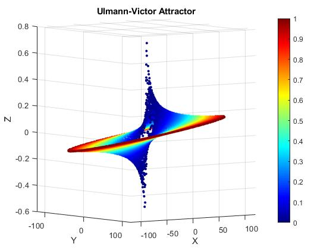
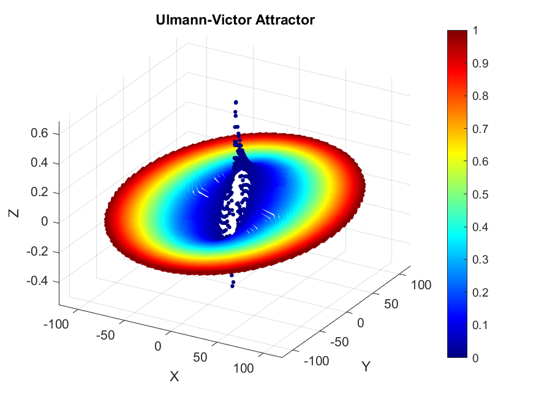
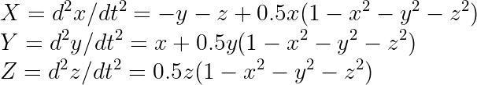

# Ulmann-Victor Attractor - Comprehensive Guide

This comprehensive guide provides an in-depth exploration of the creative process involved in constructing the visually captivating Ulmann-Victor Attractor. Utilizing second-order integro-differential equations, the power of MATLAB programming, and immersive 3D visualization, we will embark on a journey to craft an intricate and mesmerizing chaotic butterfly-like attractor.

## Prerequisites

- MATLAB installed on your system.
- Fundamental grasp of MATLAB programming.
- Familiarity with second-order differential equations and numerical integration.

## The Ulmann-Victor Attractor: Concept and Equations

The Ulmann-Victor Attractor is characterized by its intricate structure reminiscent of butterfly wings in flight. The key equations driving this chaotic beauty are expressed as follows:

These second-order integro-differential equations orchestrate the dynamic interplay between the x, y, and z coordinates, guiding the attractor's graceful yet chaotic evolution.

## Crafting the Attractor: Step-by-Step

### 1. Setting Initial Conditions

We initialize the attractor by defining the starting positions of x, y, and z along with their corresponding derivatives dx, dy, and dz.

### 2. Time Integration

The temporal domain is established by setting a time span for integration. This span is then discretized into a vector that serves as the foundation for numerical integration.

### 3. Numerical Solution

Leveraging the `ode45` solver, we navigate the intricate equations, revealing the attractor's path in a 3D space over time.

### 4. The Visual Odyssey

The enchanting aspect of the Ulmann-Victor Attractor comes to life as we utilize the `scatter3` function to transform abstract numerical data into a mesmerizing 3D visualization. The color palette adds depth and dimensionality, invoking a captivating play of colors as the attractor unfurls.

### 5. Aesthetics and Persistence

Fine-tuning the visualization angle using the `view` function allows us to capture the most engaging portrayal of the butterfly-like form. The culmination of this artistic journey is encapsulated in a PNG image, created through the `saveas` function.

## Conclusion: A Dance of Chaos and Elegance

The Ulmann-Victor Attractor stands as a testament to the harmony between chaos and elegance. Through the intricate interplay of second-order equations, numerical precision, and the artistic medium of MATLAB's visualization, we have created a breathtaking representation of the chaotic butterfly. This journey empowers you to explore the boundless creativity that emerges at the intersection of mathematics, programming, and visual art.

Feel free to modify and adapt the provided code to further personalize your encounter with the enchanting Ulmann-Victor Attractor and venture deeper into the captivating world of chaotic systems!
